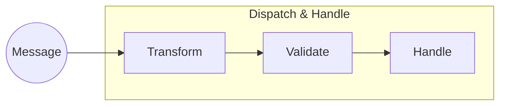
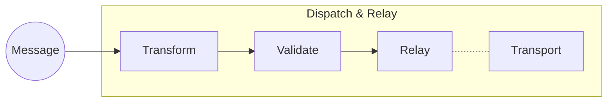
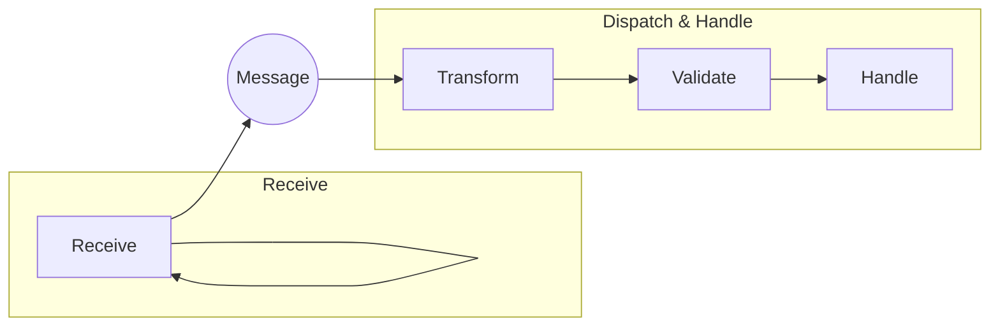

## Message Bus

### Getting started

First add the repository to your composer.json:

```
"repositories": {
    "looksystems-messagebus": {
        "type": "vcs",
        "url": "https://github.com/looksystems/messagebus.git"
    }
}
```

And then require the package as usual:

```
composer require looksystems\messagebus
```

IMPORTANT

The environment on which you are installing the package will need a github access token to be able to pull the from the lookfintech.com repository.

If required, you can generate a token here:

https://docs.github.com/en/authentication/keeping-your-account-and-data-secure/managing-your-personal-access-tokens#creating-a-fine-grained-personal-access-token

When ```composer install``` is run, it will (only once per environment) prompt for the token.

Finally, if you want to use AWS SQS or SNS, you will need to set-up the environment variables required by the [AWS PHP SDK](https://github.com/aws/aws-sdk-php) - see [transports](docs/transports.md) for more details.

_(To follow, details of how to set-up workflow or automated install scripts)_

**To send/dispatch a message:**

```
use Look\Messaging\MessageBus;

// type & payload
MessageBus::dispatch('namespace.message-type', [ /* payload */ ]);

// simple array or object
MesageBus::dispatch([
    '_type' => 'namespace.message-type',
    /* attributes */
]);
```

Or use the [Message](./src/Message.php) class:
```
use Look\Messaging\Message;

$message = Message::make('namespace.message-type')
    ->payload([ /* payload */ ])
    ->applyStamp('environment', 'development')
    ->markAsTest();

MesageBus::dispatch($message);
```

See also [designing and using messages as dtos](./docs/dtos.md).

**To register a relay:**
```
MessageBus::relay('namespace.type', 'sqs:queue');
```

**To receive and dispatch messages:**
```
MessageBus::receive('sqs:queue')->dispatch();
```

**To register a handler:**
```
// closure
MessageBus::handle('namespace.message-type', function ($message) {
    // do something here
});

// invokable
class Invokable {
    public function __invoke($message) {
        // do something here
    }
}
MessageBus::handle('namespace.message-type', new Invokable);

// handler class
MessageBus::handle('namespace.message-type', MyHandler::class);
MessageBus::handle('namespace.*', MyHandler::class);

// handler instance
MessageBus::handle('*:fallback', new MyHandler);
```

### Frameworks

Framework specific "getting started" documentation:

 * [Laravel](docs/laravel.md)
 * [Slim](docs/slim.md)

### Documentation

 * [Introduction](docs/introduction.md) 

 * [Booting](docs/booting.md) - registering handlers and relays
 * [Handling messages](docs/handlers.md) - using handlers to process messages
 * [Relaying messages](docs/relays.md) - using relays to forward messages
 * [Receiving messages](docs/receiving.md) - how to receive messages
 * [Transports](docs/transports.md) - transports are used to send/receive messages
 * [Transforming messages](docs/transformers.md) - how to transform messages
 * [Deduplicating messages](docs/dedupe.md) - how to use the dedupe handler
 * [Batching messages](docs/batch.md) - aka transactions for messages
 * [Flow control](docs/flow-control.md) - allow handlers and relays to control how messages are processed
 * [Middleware](docs/middleware.md) - extending functionality of message bus using middleware

 * [DTOs](docs/dtos.md) - designing and using message as dtos
 * [Schemas](docs/schemas.md) - validating messages using json schemas
 * [Validating messages](docs/validators.md) - writing your own custom validators

 * [Testing](docs/testing.md) - how to test your code


### Diagrams

1. Dispatch and handle message locally



2. Dispatch and relay message to be handled else where



3. Receive message and dispatch it to be handled locally


